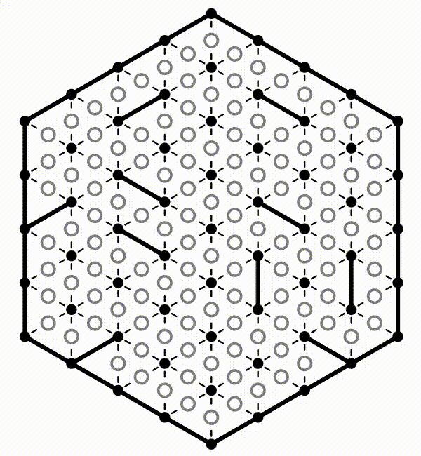
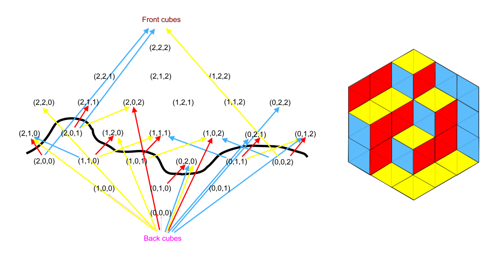
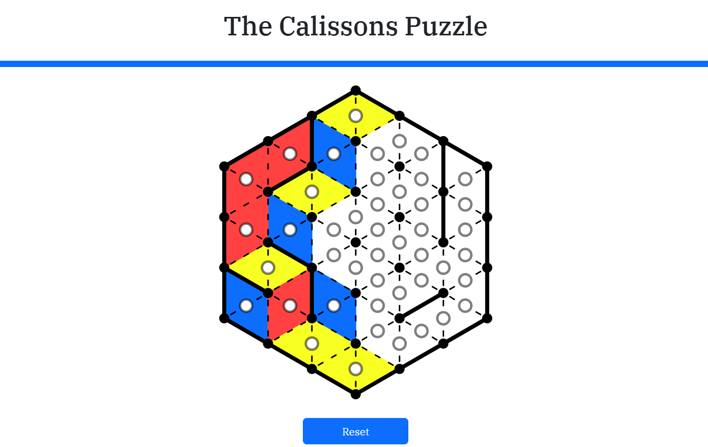

# The Calissons Puzzle

### An Interactive Web App for Automatic Puzzle Generation and Solving

<table>
<tr>
<td width="40%">

</td>
<td>

## Features

- Procedurally generates **solvable** puzzles
- Easy, Medium & Hard difficulty modes
- Seeded **Daily Puzzle** generation
- Endless mode with timer & streak tracking
- In-game tutorials detailing gameplay instructions and rules
- Automatic solution generation with algorithm visualisation
- Built with React, TypeScript & SVG rendering

</td>
</tr>
</table>

## About

The Calissons Puzzle (created by Olivier Longuet) is a geometric logic puzzle where coloured rhombus tiles must be placed inside a hexagonal grid to satisfy a set of edge constraints. This project recreates the puzzle as a modern web application, featuring procedural puzzle generation and an implementation of the **Advancing Surface Algorithm** to guarantee solvable puzzles and generate minimal solutions.

---

## The Advancing Surface Algorithm



This implementation is based on the **Advancing Surface Algorithm** described in <a href="https://doi.org/10.48550/arXiv.2307.02475"> *The Calissons Puzzle* </a>

The core solving algorithm models the puzzle as a **directed acyclic graph (DAG)** representing a 3D stepped surface hidden beneath the 2D puzzle. Puzzle edges become graph constraints, and a valid solution is found by computing a graph cut using breadth-first search.

**Key properties:**

- Guarantees generated puzzles are solvable
- Produces minimal valid solutions
- Runs in **O(n³)** time for an *n × n* puzzle
- Powers both puzzle generation and the in-app solver

---

## Gameplay

| Mode | Description |
|------|-------------|
| **Endless** | Unlimited procedurally generated puzzles of any difficulty |
| **Daily** | Three seeded puzzles (Easy, Medium & Hard) shared by all players each day |



*For detailed gameplay instructions - use the in-game tutorial.*

---

## Tech Stack

- **React** – component-based UI
- **TypeScript** – type-safe application logic
- **Vite** – development & build tooling
- **SVG** – scalable interactive puzzle rendering

---

## Running Locally

```bash
git clone https://github.com/beanboot/calissons-puzzle
cd calissons-puzzle
npm install
npm run dev
```

---

## Future Improvements

- Expanded difficulty balancing using player data
- Online leaderboards
- Additional puzzle sizes and game modes
- Improved algorithm visualization